# How a Graph Convolutionnal Network's forward pass works

In this project, I'm going to walk you through step by step forward mechanism of a GCN. And after this tutorial, 
you will understand more about the basics of Graph Neural Networks. It will be helpful if you know a little 
knowledge about graph networks like what an adjacency matrix, the degree of a node, a degree matrix,... are and
fully connected networks. I will try to explain everything in a clear way so you can follow along from the beginning
to the end without any hindrance.

## Abbreviation

  
| Terminology | Description |
| ----------- | ----------- |
| GCN      | Graph Convolutional Network       |
| GNN      | Graph Neural Network       |
| CNN   | Convolutional Neural Network        |
  

## 1. What makes GCNs different from CNNs?
To answer this question, we have to go through knowledge about CNNs a bit. CNNs use an operation called "convolution", which refers to multiplying the input neurons with a set of weights that are known as *filters* or *kernels*. These filters have a role like a sliding window across the whole image, which enables CNNs can learn features from neighboring cells. One of the special things about CNN is that it has **weight sharing** mechanism, which means within the same layer, the same filter will be used throughout the image (a layer here means a convolutional layer). For instance, using CNN to classify an image is a cat or not, the same filter will be used in the same layer to detect the nose and the ears of the cat (illustration below). 

  

GCNs perform operations that are similar to convolution in CNNs, which is the GCN model learns features from neighboring nodes. The major difference between GNNs (in general) and CNNs is that CNNs are specially built to operate on Euclidean data, which is considered as regular structured data (data points that can be plotted on a multidimensional plain. For example, point A has x cordination is 3 and y cordination is 4 can be plotted on a 2D plain at x=3, y=4), while GNNs are the generalized version of CNNs where the nodes connections (edges in a graph) can vary and the nodes are unordered. Because of these, GNN can work well on irregular structured data (non-Euclidean data). 
GCNs can be categorized into 2 major algorithms, that are **Spatial Graph Convolutional Networks** and **Spectral Graph Convolutional Networks**. In this tutorial, we will focus on **Spectral Graph Convolutional Networks**. Until now, I have done the basics you need to know to answer the question above. Next, we will move on to the detailed caculations inside a GCN when forwarding.

## 2. Fast approximate spectral Graph Convolutional Networks

  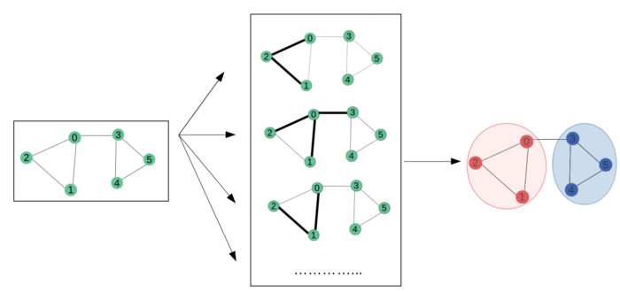

The original idea behind Spectral GCN is that information in a graph propagated node by node. In this approach, we will take into account the **adjacency matrix A** in addition to node features. **A** is a matrix representing connections (edges) between nodes in the forward propagation equation. By adding **A** to the forward equation, it enables the GCN model to learn feature representations based on nodes connectivity (illustrated above). For the sake of simplicity, the bias term **b** will be omitted. The forward function is given below

  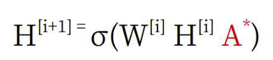

To this point, you may wonder what the <strong>A*</strong> is. Simply, <strong>A*</strong> is the normalized version of **A**. Why do we need to normalize **A**? Let's see in the following parts.

## 3. Building a Graph Convolutional Network
### 3.1 Initializing the Graph G
We will use [NetworkX](https://networkx.org/) to create an undirected graph **G**. The graph consists of 6 nodes, and each node feature is its own order number. For instance, node 1 will have a feature 1, node 2 will have a feature 2, so on and so forth. In this tutorial, we're not going to use edge features.

**Output:**

  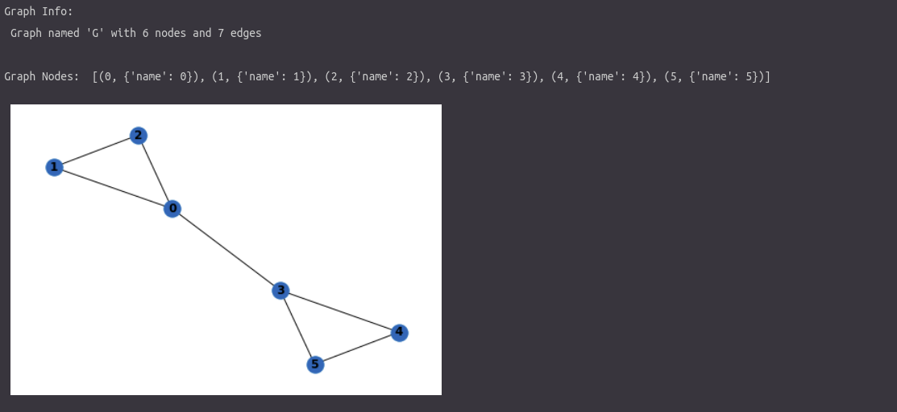

### 3.2 Adding an adjacency matrix A to the forward function
The next step is to obtain the **Adjacency Matrix** (**A**) and the **Node Features Matrix** (**X**) from graph **G**.

**Output:**

  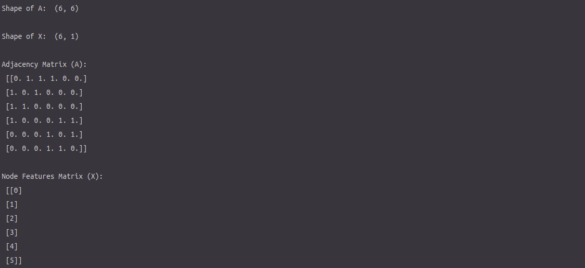

Next, we're going to perform dot product **A** and **X** to see how inserting the adjacency matrix **A** to the forward function can add to richer features representation of the GCN model.

**Output:**

  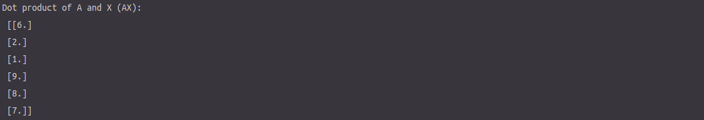

The key thing to note in mind is that **AX** is the result of the **sum of neighboring nodes features**. For example, the first row of **AX** corresponds to the sum of nodes features connected to node 0, which is node 1, 2, and 3. This gives us an idea of how the node connectivity impacts the hidden features representation. If you pay more attention to **AX**, you can see that **AX** **doesn't take into account the features of the node itself**. We can fix this by adding self-loops to the adjacency matrix **A**.
### 3.3 Inserting self-loops and normalizing A
Adding self-loops is like connecting a node to itself. That means all diagonal elements of **A** will be 1 because each node connect to itself. Call **A_hat** is the adjacency matrix **A** with self-loops inserted. Now, we will calculate the product of **A_hat** and **X**, called **AX**.

**Output:**

  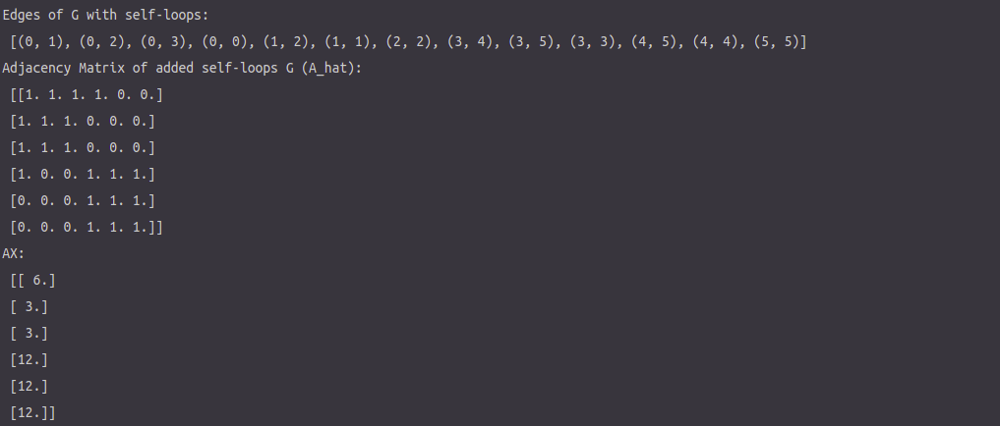

A new problem arises, which is the elements of **AX** is **not normalized**. Similar to data pre-processing for any Neural Networks operation, we need to normalize the features to **prevent numerical instabilities** and **vanishing/exploding gradients** in order for the model to converge. In GCNs, we normalize our data by **calculating the Degree Matrix (D) and performing dot product operation of the inverse of D with AX**. The normalized features function is shown below

  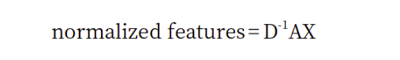

We will call it **DAX** from now on. In graph theory, degree means the number of edges a node is connected to.

  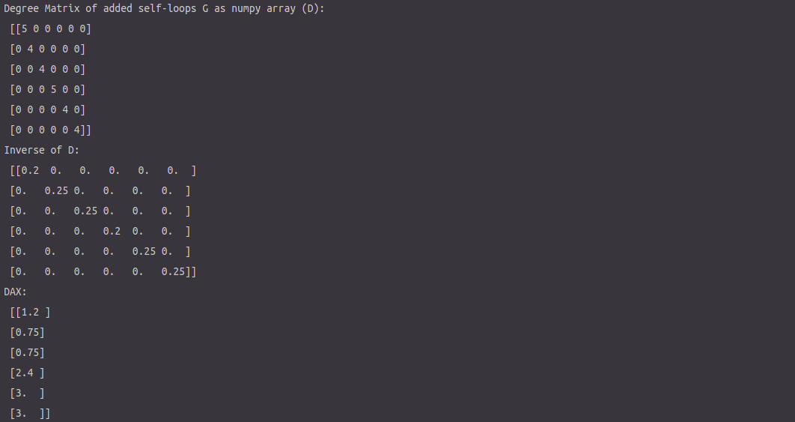

If we compare **AX** (unnormalized) with **DAX** (normalized), we will notice that:

  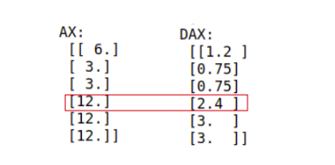

Why would node 3 have different values from node 4 and 5 after normalization if they have the same initial values (12)?
Let’s take a look back at our graph. Node 3 has 3 incident edges, while nodes 4 and 5 only have 2 incident edges. The fact that node 3 has a higher degree than node 4 and 5 leads to a lower weighting of node 3’s features in DAX. In other words, the lower the degree of a node, the stronger that a node belongs to a certain group or cluster.
In fact, people usually perform symmetric normalization, this method is shown below

  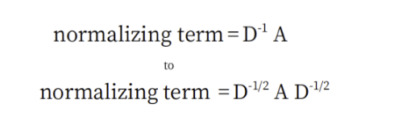

Let’s calculate the normalized values using the new symmetric normalization equation:

  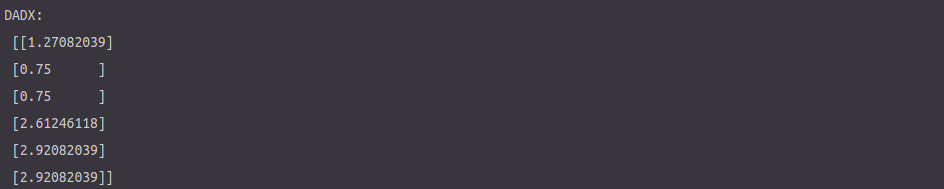

Until now, we will realize that <strong>A*</strong> above is referred as **renormalization trick**.
We have done with features handling, now we will finalize our GCN.
### 3.4 Adding weights and an activation function
We're going to build a 2-layer GCN, 1 hidden layer and 1 output layer using ReLU as the activation function. We will use random seeds to reproduce experimental results. First things first, we need to initialize weights, which cannot be 0. In this experiment, we are going to set 4 neurons for the hidden layer. We will create only 2 output neurons for plotting the features representation in a 2D plain.

**Output:**

  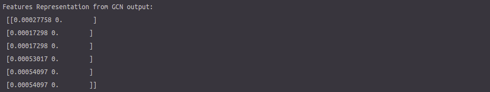

Yeah! We have just done building our feed-forward GCN, cheers!!! 
### 3.5 Plotting the feature representations
The special thing of GCN is that it **can learn features representation even before training**. 

  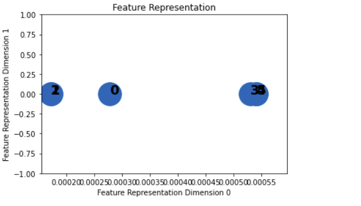

From the plot above, it can be clearly seen that there are 2 major groups, where the left group consists of nodes 0, 1, 2, and the right group consists of nodes 3, 4, 5. We can infer that the GCNs **can already learn the feature representations even before training or backpropagation**.

## Key things to note in mind
1. Basically, the term "convolution" in GCN and CNN are similar with regard to "weight sharing" mechanism.
2. By adding an adjacency matrix **A** to the forward function of GCNs, it enables a node can learn from the features of its own neighboring nodes. This mechanism is called message passing operation (information passing through the nodes in the graph).
3. We normalized features using "renormalization trick" from the article Fast Approximate Spectral-based Graph Convolutional Networks.
4. GCNs can learn features representation even before training.

## Keywords
Graph convolutional networks, Convolutional neural networks, Message passing, Fast approximation spectral graph convolutional networks

## References:
1. [Understanding Graph Convolutional Networks for Node Classification](https://towardsdatascience.com/understanding-graph-convolutional-networks-for-node-classification-a2bfdb7aba7b)
2. [Semi-Supervised Classification with Graph Convolutional Networks by Thomas N. Kipf, Max Welling](https://arxiv.org/abs/1609.02907)
