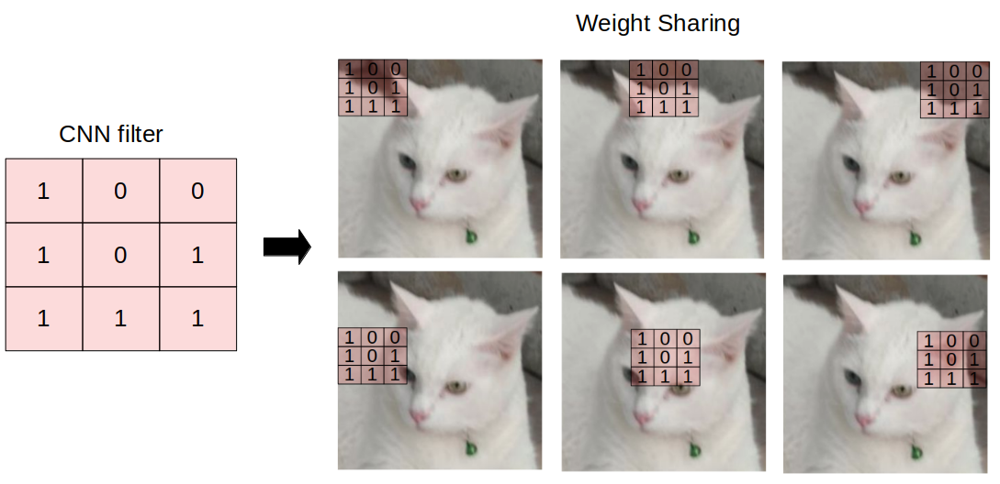

# How a Graph Convolutionnal Network's forward pass works

In this project, I'm going to walk you through step by step forward mechanism of a GCN. And after this tutorial, 
you will understand more about the basics of Graph Neural Networks. It will be helpful if you know a little 
knowledge about graph networks like what an adjacency matrix, the degree of a node, a degree matrix,... are and
fully connected networks. I will try to explain everything in a clear way so you can follow along from the beginning
to the end without any hindrance.

## Abbreviation

| Terminology | Description |
| ----------- | ----------- |
| GCN      | Graph Convolutional Network       |
| GNN      | Graph Neural Network       |
| CNN   | Convolutional Neural Network        |

## 1. What makes GCNs different from CNNs?
To answer this question, we have to go through knowledge about CNNs a bit. CNNs use an operation called "convolution", which refers to multiplying the input neurons with a set of weights that are known as *filters* or *kernels*. These filters have a role like a sliding window across the whole image, which enables CNNs can learn features from neighboring cells. One of the special things about CNN is that it has **weight sharing** mechanism, which means within the same layer, the same filter will be used throughout the image (a layer here means a convolutional layer). For instance, using CNN to classify an image is a cat or not, the same filter will be used in the same layer to detect the nose and the ears of the cat (illustration below). 

GCNs perform operations that are similar to convolution in CNNs, which is the GCN model learns features from neighboring nodes. The major difference between GNNs (in general) and CNNs is that CNNs are specially built to operate on Euclidean data, which is considered as a regular structured data (data points that can be plotted on a multidimensional plain. For example, point A has x cordination is 3 and y cordination is 4 can be plotted on a 2D plain at x=3, y=4), while GNNs are the generalized version of CNNs where the nodes connections (edges in a graph) can vary and the nodes are unordered. All if them make GNN works well on irregular structured data (non-Euclidean data). 
GCNs can be categorized into 2 major algorithms, that are **Spatial Graph Convolutional Networks** and **Spectral Graph Convolutional Networks**. In this tutorial, we will focus on **Spectral Graph Convolutional Networks**. Until now, I have done the basics you need to know to answer the question above. Next, we will move on to the detailed caculations inside a GCN when forwarding.

## Key things to note in mind
1. Basically, the term "convolution" in GCN and CNN are similar with regard to "weight sharing" mechanism.
2. By adding an adjacency matrix A to the forward function of GCNs, it's enable a node can learn from the features of its own neighboring nodes. This mechanism is called message passing operation (information passing through the nodes in the garphs).
3. We normalized features using "renormalization trick" from the article Fast Approximate Spectral-based Graph Convolutional Networks.
4. GCNs can learn features representation even before training.

## Keywords
Graph convolutional network, Convolutional Neural Network, Message passing, Fast approximation

## References:
1. https://towardsdatascience.com/understanding-graph-convolutional-networks-for-node-classification-a2bfdb7aba7b
